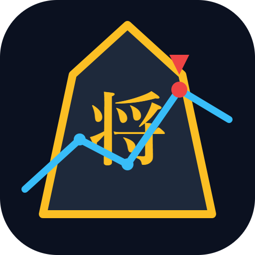

<div align="center">
  

  <h1>ShogiAnalytics</h1>
  <p><strong>将棋の力を、深く。次世代の対局分析プラットフォーム</strong></p>

  <p>
    
    
    
    
  </p>
  <p>
    
    
    
  </p>
</div>

---

## 概要

**ShogiAnalytics** は、YaneuraOu USI エンジンと連携するリアルタイム将棋分析アプリです。ブラウザでもスマートフォンでも、プロ級の解析をすぐに使える UI で提供します。

> このリポジトリは **フロントエンド**のみです。エンジン連携・分析API は別リポジトリ（非公開）で管理されています。

---

## 機能

| 機能 | 説明 |
|------|------|
| 🤖 エンジン解析 | YaneuraOu USI による深い候補手分析 |
| 📊 評価値グラフ | 棋譜全体の形勢推移を視覚化 |
| ♟️ インタラクティブ盤面 | タッチ対応・盤面反転・手戻しに完全対応 |
| 🆚 AI 対局 | 段階別強さでAIと対戦 |
| 📱 モバイルアプリ | Capacitor で Android ネイティブアプリ化 |
| 🌍 多言語 | 日本語・英語に自動対応 |
| 💾 棋譜管理 | 対局の保存・読み込み |

---

## 技術スタック

```
React 19 + Vite 8 ───── UI & ビルド
TailwindCSS 3 ────────── スタイリング
React Router 7 ──────── ルーティング
Socket.io Client ────── バックエンドとのリアルタイム通信
Recharts ────────────── 評価値グラフ
Capacitor 7 ─────────── Android アプリ化
i18next ─────────────── 多言語対応
```

---

## クイックスタート

### 必要な環境

- **Node.js** 18+

### セットアップ

```bash
git clone https://github.com/pkki/ShogiAnalytics.git
cd ShogiAnalytics
npm install
npm run dev
```

開発サーバーが `http://localhost:5173` で起動します。

> バックエンドサーバーが別途 `http://localhost:3001` で動いている必要があります。

---

## ビルド & デプロイ

```bash
# Web 向けビルド（出力: dist/）
npm run build

# Android APK ビルド
npm run android:apk
```

---

## プロジェクト構成

```
ShogiAnalytics/
├── src/
│   ├── App.jsx                  # メインアプリ
│   ├── components/
│   │   ├── ShogiBoard.jsx       # 盤面 UI
│   │   ├── GameSetupDialog.jsx  # AI 対局設定
│   │   └── NavigationPanel.jsx  # ナビゲーション
│   └── state/
│       └── gameState.js         # 棋譜・盤面ロジック
├── public/
│   └── icons/                   # アプリアイコン各サイズ
└── android/                     # Capacitor Android プロジェクト
```

---

## スクリプト

```bash
npm run dev           # 開発サーバー起動
npm run build         # 本番ビルド
npm run preview       # ビルド結果プレビュー
npm run lint          # ESLint 検査
npm run android:sync  # Android 同期
npm run android:open  # Android Studio 起動
npm run android:apk   # APK ビルド
```

---

## ライセンス

[MIT](LICENSE)

---

<div align="center">
  <sub>Built with ♟️ for Shogi players worldwide</sub>
</div>
